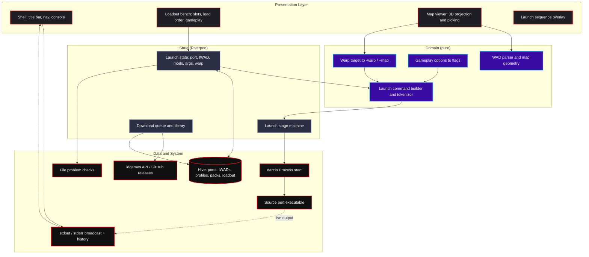

# 🩸 QuickDoom

[](https://github.com/VerianCS/QuickDoom/actions/workflows/deploy.yml)
[](https://github.com/VerianCS/QuickDoom/releases/latest)
[](LICENSE)


**QuickDoom** is a cross-platform launcher for Doom source ports, built with Flutter Desktop. It keeps your engines, IWADs and mod load order in one place, builds the command line for you, and gets out of the way.

---

## Why This Exists

Classic launchers like ZDL were legendary, but they have not kept pace with how people manage large modlists now. Most "modern" launchers are Electron wrappers that eat more RAM than a browser with fifty tabs open just to show a dropdown.

QuickDoom splits the difference: a native desktop app with a deliberate UI *and* a small footprint.

---

## What It Does Today

Everything in this section is implemented and covered by tests. Nothing here is aspirational.

### The bench

The launcher screen is a loadout bench. A **source port** and an **IWAD** each sit in a seated slot; empty slots are hatched and captioned so an unfilled requirement is obvious, and a slot whose file has been moved, deleted or left non-executable turns amber and says so **before** you press Launch rather than after.

Mods stack in a numbered **load order** rail with drag-to-reorder, per-row enable toggles, and the deepest file marked `TOP`, because Doom resolves duplicate lumps by position and a flat list hides that.

A **Gameplay** row covers the five difficulties by their Doom names (ITYTD → NM) plus Fast, No Monsters and Respawn, so the common flags do not have to be typed. A free-text **Arguments** field handles everything else, and it is tokenized properly — `-file "C:\Program Files\Doom\x.wad"` stays one argument.

The whole bench is **remembered between runs**. Ports and IWADs are stored by id, so one you deleted since does not come back as a dead entry.

### Launch sequence

Launching is a staged takeover — arm, charge, ignite, handoff — that covers the second or so a source port takes to put a window on screen. The process is spawned early, during charge, so the animation never delays the launch; if the spawn fails, the sequence aborts into a fault state instead of hiding the window over a game that never started. On exit the window returns with a session readout: port, IWAD, mods loaded, time played, exit code, and the last stderr lines when the exit code is non-zero.

The animation can be switched off, and is skipped automatically when the platform asks for reduced motion.

### Map viewer

Opens a WAD or PK3 and reconstructs every map in it as a holographic 3D projection — walls extruded from sector heights, orbit/pan/zoom, click to inspect a linedef, sector or thing. Selecting a map and pressing **Launch MAPxx** seats it on the bench and switches to it, adding the map's own file to the load order if it is not already loaded.

Warping uses `-warp`, which vanilla, Boom, DSDA, Chocolate and the ZDoom family all accept; a PWAD with a non-standard lump name falls back to `+map`.

### Mods and engines

- **Mod Browser** — searches the [Doomworld /idgames archive](https://www.doomworld.com/idgames/) and downloads with live progress.
- **Engine Manager** — lists GitHub releases for known source ports and downloads them.
- **Library** — tracks what has been installed on disk, with archive extraction and executable detection.
- **Mod Packs** — named collections of installed mods that can be loaded onto the bench in one go.
- **Profiles** — full loadouts (port, IWAD, mod stack, arguments) saved and switched from a rack down the left edge.

### Console

A CRT-styled panel streams the port's `stdout` and `stderr` live, with a state rail showing `IDLE` / `RUNNING` / `EXIT n` and a line count. Output is buffered from the moment the process starts, so nothing is lost to whichever part of the app happened to attach first.

---

## What It Does Not Do

Stated plainly so nobody installs this expecting them:

- **No multiplayer.** No server browser, no `-net`, no Zandronum/Odamex session handling.
- **No savegame or demo management.** `-loadgame`, `-playdemo` and `-record` are not wired up; you can pass them by hand in the arguments field.
- **No system tray.** The `system_tray` package is a dependency but nothing uses it yet. The window hides during play and returns on exit — that is window management, not a tray icon.
- **No settings screen.** Preferences such as default directories live nowhere; the only toggle is the launch animation, in the launch bar.
- **Four screens still use the old look.** Library, Mod Browser, Engines and Mod Packs have not been moved onto the current design system, so they visibly lag the shell and the launcher.
- **No mod dependency resolution.** Load order is yours to get right; QuickDoom shows it clearly but does not reason about it.

---

## Realistic Roadmap

Roughly in the order it makes sense to do, not a schedule and not a promise.

| | Item | Notes |
|---|---|---|
| Next | Finish the design pass | The four remaining screens onto the shared primitives, then a polish pass (fixed slot heights — seating a port currently nudges the layout). |
| Next | Savegames and demos | `-loadgame`, `-playdemo`, `-record`. Demo recording in particular is cheap and is a real community feature. |
| Later | Settings screen | Default directories, preferred port, where downloads land. |
| Later | Per-port argument profiles | GZDoom and DSDA-Doom do not take the same flags; the launcher could stop pretending they do. |
| Later | IWAD auto-detection | Scan the usual Steam/GOG locations instead of making everyone browse. |
| Maybe | Multiplayer | Large, and only worth it with a real design behind it. |

---

## Download

Prebuilt binaries are on the [Releases page](https://github.com/VerianCS/QuickDoom/releases/latest). Windows is the primary target; Linux and macOS come off the same CI matrix and get less manual testing.

## Performance

QuickDoom starts fast and stays small, which is most of the point.

Cold start is measured by an in-app stopwatch that stops when the first frame is ready (look for `⚡ Bootstrap ready` in debug output). On the development machine used for this project it lands in the low hundreds of milliseconds in debug builds; release builds are faster. **Measure it on your own hardware rather than trusting a number in a README** — build type, GPU driver and disk all move it more than anything in this codebase does.

How it is kept low:

1. **Non-blocking `main()`** — the first frame renders before disk and config reads happen.
2. **Post-frame hydration** — fonts and non-critical assets load after the first paint.
3. **Lazy Hive reads** — only what the current screen needs is read at startup.

Release builds are tree-shaken, obfuscated and symbol-stripped, then UPX-compressed and packed into a single executable with `warp-packer` on Windows.

## Tech Stack

- **Framework:** Flutter Desktop (Windows, Linux, macOS)
- **Language:** Dart 3
- **State:** `flutter_riverpod` with `riverpod_generator`
- **Persistence:** `hive` / `hive_flutter`, stored as plain maps so a new field cannot strand an existing box
- **Desktop:** `window_manager`, `desktop_drop`, `file_picker`
- **Network:** `http`, `archive`
- **Packaging:** CMake, UPX, warp-packer

## Architecture

Clean Architecture, keeping process execution and file I/O away from the Flutter presentation layer.



## Building From Source

**Prerequisites**

- Flutter SDK, stable channel. Recent enough for Dart 3.10; if the build fails on an unknown named parameter, your Flutter is older than the one the code was written against.
- A C++ desktop toolchain: Visual Studio with the C++ workload on Windows, `clang`/`cmake`/`ninja`/`libgtk-3-dev` on Linux, Xcode on macOS.

```bash
git clone https://github.com/VerianCS/QuickDoom.git
cd QuickDoom

flutter pub get

# Run it
flutter run -d windows        # or -d linux, -d macos

# Tests
flutter test

# Regenerate Riverpod providers after touching an annotated provider
dart run build_runner build --delete-conflicting-outputs

# Optimized release build
flutter build windows --release --split-debug-info=./symbols --obfuscate --tree-shake-icons
```

## Testing

```bash
flutter test          # 380 tests
flutter analyze
```

The suite favours tests that would have caught a real bug: argument tokenization with quoted Windows paths, load-order index arithmetic driven through actual drag gestures, restoring a loadout whose saved port no longer exists, and the file checks behind a broken slot. Several exist specifically because they fail against the implementation they replaced.

## CI/CD Pipeline

Pushing a version tag triggers the matrix pipeline in `.github/workflows/deploy.yml`:

```bash
git tag v1.1.0
git push origin v1.1.0
```

It builds Windows, Linux and macOS, tree-shakes and strips symbols, UPX-compresses, packs Windows into a single executable with warp-packer, and publishes the artifacts to a GitHub Release.

## Contributing

Issues and pull requests are welcome. Two things worth knowing:

- Persistence uses plain maps rather than typed Hive adapters, on purpose — adding a field should never strand an existing box.
- Providers are code-generated; run `build_runner` after changing an annotated one, and commit the `.g.dart` output.

## License

Distributed under the MIT License. See [LICENSE](LICENSE) for details.
