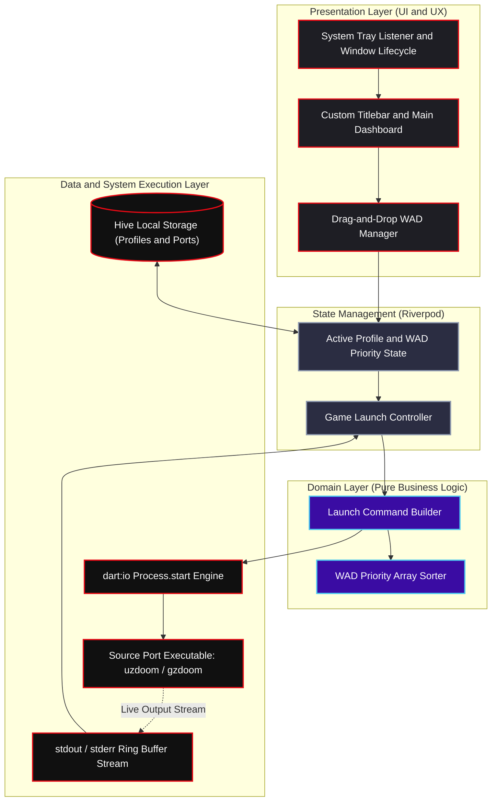

# 🩸 QuickDoom

[](https://github.com/VerianCS/QuickToDoom/actions/workflows/deploy.yml)
[](https://github.com/VerianCS/QuickToDoom/releases/latest)
[](LICENSE)


**QuickDoom** is a modern, cross-platform Doom source port & mod launcher built with Flutter Desktop.

While a lot of modern desktop launchers burn 500MB of RAM and take seconds to paint a single button, QuickDoom boots in **~121ms** (release build) and ships as a **~10MB** single-file executable. No install wizard, no runtime bloat — just launch and go.

---

## Why This Exists

Classic launchers like ZDL were legendary back in the day, but they haven't kept pace with how people manage large modlists now. On the other end, most "modern" launchers are Electron wrappers that eat more RAM than a browser with 50 tabs open just to show a dropdown.

QuickDoom is my attempt to split the difference: a native desktop app with a clean, modern UI *and* the boot speed and footprint of something written for 2006 hardware.

## Highlights

- **Instant Boot** — First frame renders before storage or config files are touched; non-critical assets hydrate after paint. ~221ms cold start in debug, ~121ms in release.
- **~10MB Single Binary** — Compressed with UPX and packed via `warp-packer` into one standalone executable.
- **Drag-and-Drop Mod Priority** — Drop `.wad`, `.pk3`, `.pk7`, `.ipk3`, `.ipk7`, `.deh`, `.bex`, or `.zip` files straight into the launcher and reorder load priority live.
- **Profiles & Presets** — Save full mod combos (source port, IWAD, PWAD stack, custom args) as reusable profiles, powered by Hive + Riverpod.
- **Live Process Console** — Launches via native `dart:io Process.start()`, streams `stdout`/`stderr` in real time, auto-minimizes on launch, restores on exit.
- **System Tray Integration** — Minimizes to tray during play, intercepts the close button, sits near-idle in the background.

## Download

Grab the latest prebuilt binary from the [Releases page](https://github.com/VerianCS/QuickToDoom/releases/latest) — Windows is the primary target; Linux and macOS builds are produced by the same CI pipeline.

## Benchmarks

*Measured on my dev machine — not a formal benchmark suite. Take the Electron/Flutter comparison figures as ballpark, not lab-verified.*

| Metric | Typical Electron App | Standard Flutter App | **QuickDoom** |
|---|---|---|---|
| Cold Boot Time | ~2,500 ms | ~400 ms | **~221 ms (Debug) / ~121 ms (Release)** |
| Executable Size | ~150 MB | ~35 MB | **~10.5 MB (UPX + Warp Packed)** |
| RAM Footprint | ~350 MB | ~80 MB | **~35 MB** |

**How the boot time was achieved:**
1. **Zero-blocking `main()`** — first UI frame renders before disk/config reads happen.
2. **Post-frame asset hydration** — font tables and non-critical assets load after the first paint.
3. **Lazy Hive hydration** — only the active profile is loaded on startup instead of the whole database.

## Tech Stack

- **Framework:** Flutter Desktop (Windows, Linux, macOS)
- **Language:** Dart 3.x
- **State Management:** flutter_riverpod
- **Persistence:** hive / hive_flutter
- **Desktop Integration:** window_manager, tray_manager, desktop_drop, file_picker
- **Packaging:** CMake (`/Os` size optimization), UPX, warp-packer

## Architecture

QuickDoom follows Clean Architecture, decoupling OS process execution and file I/O from the Flutter presentation layer.



## Building From Source

**Prerequisites**
- Flutter SDK (stable channel)
- C++ Desktop Build Tools (Visual Studio with the C++ workload, for Windows)

```bash
# Clone
git clone https://github.com/VerianCS/QuickToDoom.git
cd QuickToDoom

# Install dependencies
flutter pub get

# Run in debug mode
flutter run -d windows

# Run the test suite
flutter test

# Build an optimized release binary
flutter build windows --release --split-debug-info=./symbols --obfuscate --tree-shake-icons
```

## CI/CD Pipeline

Pushing a version tag (`git tag v1.0.0 && git push origin v1.0.0`) triggers the GitHub Actions matrix pipeline (`.github/workflows/deploy.yml`), which:

1. Builds for Windows, Linux, and macOS.
2. Runs AOT tree-shaking and symbol stripping.
3. Compresses with UPX.
4. Packages into a single executable with warp-packer.
5. Publishes binaries automatically to GitHub Releases.

## License

Distributed under the MIT License. See [LICENSE](LICENSE) for details.
